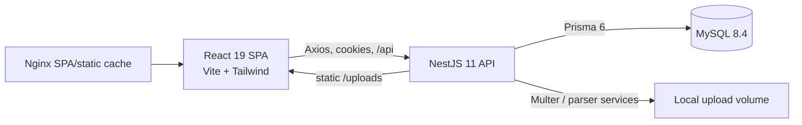
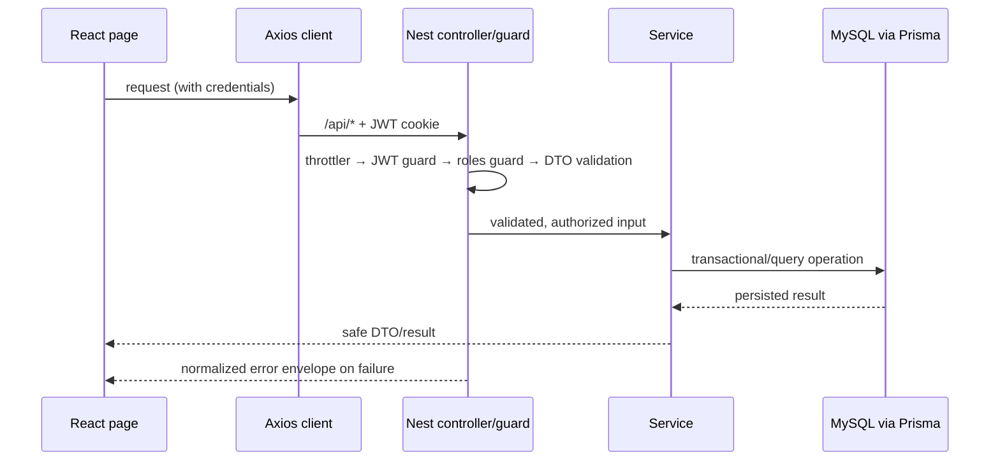
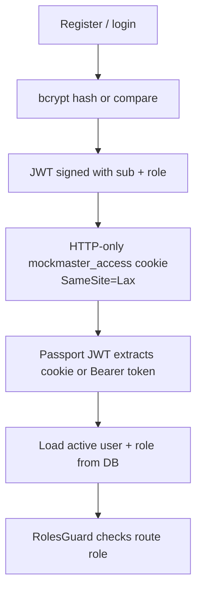
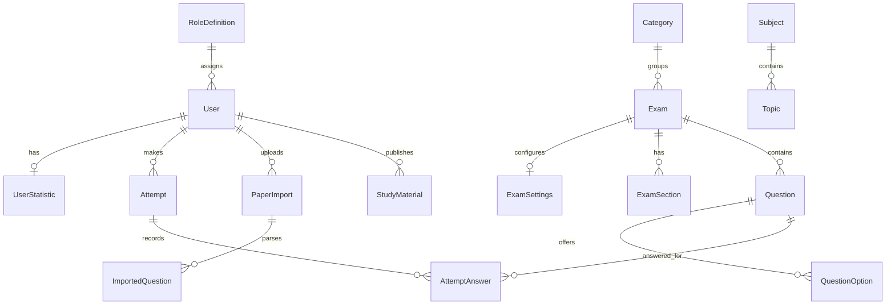

# Architecture — MockMaster

**Last verified:** 2026-09-20. Labels describe source currently present in this repository.

## System overview

### Technology inventory

| Area | IMPLEMENTED technology |
| --- | --- |
| Web client | React 19, TypeScript, Vite 7, React Router 7, Tailwind 3 |
| Client data/UI | TanStack Query, Axios, React Hook Form, Zod, Recharts, Lucide, React Markdown/KaTeX |
| API | NestJS 11, Express adapter, TypeScript |
| Data | MySQL with Prisma 6 migrations and generated client |
| Security | Passport JWT, `@nestjs/jwt`, bcrypt, Helmet, CORS, class-validator, Nest throttler |
| Scheduling | `@nestjs/schedule` interval processor |
| Imports | pdf-parse, Mammoth, read-excel-file, csv-parse, Multer |
| Deployment | Docker Compose, Node 22 Alpine backend, Nginx 1.27 frontend |
| Tests | Jest/ts-jest backend; Vitest/Testing Library frontend |

No Next.js, GraphQL, Redis, object storage, background queue, email provider, or external identity provider is implemented.

## Frontend — IMPLEMENTED

`frontend/src/main.tsx` mounts a `QueryClientProvider`, `BrowserRouter`, `AuthProvider`, `LanguageProvider`, and `ToastProvider`. `App.tsx` lazy-loads public, student, and admin pages. `ProtectedRoute` restores `/auth/me`, redirects anonymous users to login, and redirects a role mismatch to that role’s dashboard.

Folder responsibilities:

| Path | Responsibility |
| --- | --- |
| `pages/public` | Landing, registration, login |
| `pages/student` | Student dashboard, exam flow, results, performance, calendar, resources |
| `pages/admin` | Content authoring, imports, records, analytics, calendar/materials |
| `components` | Shared presentational/interaction components and route guard |
| `contexts` | Authentication, language preference, toast state |
| `features` | Exam state, submit confirmation, admin payloads, calendar helpers |
| `layouts` | Authenticated responsive application shell |
| `lib` | Axios API client, formatting, media URL resolution |
| `types` | Shared frontend shape definitions |

State boundaries: server data uses TanStack Query in pages; app-wide identity/language/toasts use React context; transient interactions use local component state; the live test caches unsaved answer mutations in `localStorage` to recover from interrupted requests.

### Frontend routes — IMPLEMENTED

- Public: `/`, `/login`, `/register`.
- Student: `/student/dashboard`, `/student/exams`, `/student/exams/:id`, `/student/test/:attemptId`, results/review, attempts, performance, leaderboard, resources/viewer, calendar, profile.
- Admin: dashboard; exams/create/edit/questions/preview/sections/analytics; question bank; import/review; materials; students/detail; attempts; analytics; calendar; categories; subjects; settings.

The test route intentionally sits outside `AppLayout` to give the CBT interface its own full-screen layout.

## Backend and request flow — IMPLEMENTED

Nest's global `/api` prefix reaches controllers for `auth`, `student`, and `admin`.

`AppModule` configures global `ThrottlerGuard`, JWT guard, and roles guard. The `@Public()` metadata exempts registration/login; `@Roles()` constrains admin/student controllers. `ValidationPipe` uses whitelist + forbid non-whitelisted + transform. `RequestContextMiddleware` assigns/forwards `X-Request-Id`. `AllExceptionsFilter` maps HTTP/Prisma/upload failures to `{ success, message, timestamp, status, code, requestId }`, logs safe request context for server errors, and never sends a stack trace to the browser.

### Error visibility — IMPLEMENTED

The frontend converts Axios failures into `AppError` values with HTTP status, API code, and request ID. React Query query/mutation cache failures, uncaught browser promise/runtime failures, and React render failures all report through one deduplicated error event channel. `ToastProvider` makes unexpected failures visible; local mutation error handlers and page-level `ErrorState` retain contextual feedback. `AppErrorBoundary` prevents a render exception from leaving a blank screen and provides recovery actions. Server errors show the request reference to the user so support can correlate it with the structured Nest log.

### API conventions — IMPLEMENTED

- Base: `VITE_API_URL` or `http://localhost:3000/api`.
- Browser requests use `withCredentials: true`; response interceptor redirects most 401s to `/login` and turns API errors into `Error` values.
- Safe request/response behavior, method catalog, and representative bodies are in [API.md](API.md). It should be updated when adding calendar/material endpoints that were added after parts of its initial catalog.
- Controllers remain thin: service modules own domain behavior; DTOs own transport validation.

## Authentication and authorization — IMPLEMENTED

Passwords are bcrypt-hashed at cost 12. JWT verification reads the Bearer token or `mockmaster_access` cookie, then loads the current user and rejects inactive users. Cookie `secure` follows `COOKIE_SECURE`; production must set it true behind HTTPS. The system does not implement refresh tokens, password resets, or email verification.

## Database — IMPLEMENTED

The Prisma schema uses MySQL and maps models to plural tables. `prisma/migrations` is the schema history; run migrations through root scripts. Database topology:

Key integrity rules: unique user email; unique role code; unique topic name within subject; unique question order within exam; unique option label within question; unique attempt number per user/exam; unique answer per attempt/question; one daily reward per user/day; one calendar-goals record per user. UUIDs identify domain entities. Relation delete behaviors protect or cascade dependent data as declared in `schema.prisma`.

## Exam integrity and data flow — IMPLEMENTED

1. Admin creates/reviews draft data and publishes only after server validation.
2. Student starts/resumes an attempt; the API sets `expectedEndTime`.
3. The active-attempt response deliberately omits `isCorrect`, explanations, and translated explanations.
4. The client saves selection/review/visit/current question; the service verifies attempt ownership/status and option/question relationship.
5. Submission/expiry server-side locks the attempt, calculates score and aggregates user statistics.
6. Result/review responses are gated by ownership, completion, and exam settings.

`ExpiryProcessor` calls expiry handling every 60 seconds. Score is server-only: correct answers add question marks; wrong answers subtract that question’s negative marks; unanswered adds no score; accuracy is correct/attempted and percentage is score/total marks.

## Storage, imports, and external boundaries — IMPLEMENTED / PLANNED

**IMPLEMENTED:** Multer accepts import/material uploads; `MediaService` verifies image magic bytes (PNG/JPEG/GIF/WebP) and PDF signature, assigns UUID filenames, and writes public assets below `UPLOAD_DIR/public`. Nest statically serves them as `/uploads/` with cross-origin resource policy adjusted for the frontend. Parsers support PDF, DOCX, XLSX, CSV, and JSON content. Local Docker uses a named uploads volume.

**PLANNED:** object storage, signed/private asset URLs, antivirus/malware scanning, durable parsing workers/queue, OCR for scanned PDFs, and a CDN.

## Configuration, deployment, caching, and operations

### Environment — IMPLEMENTED

| Variable | Purpose |
| --- | --- |
| `DATABASE_URL` | MySQL connection used by Prisma |
| `JWT_SECRET`, `JWT_EXPIRES_IN` | JWT signing and session lifetime |
| `NODE_ENV`, `PORT` | runtime mode and API port |
| `FRONTEND_URL`, `VITE_API_URL` | CORS/frame-ancestor origin and SPA API base |
| `COOKIE_SECURE` | secure cookie switch |
| `UPLOAD_DIR`, `MAX_UPLOAD_MB` | local file location and request ceiling |
| `THROTTLE_TTL_MS`, `THROTTLE_LIMIT` | general rate limiting |

`ConfigModule` reads `../.env` then `.env`. Never commit real secrets. The root `.env.example` has development-only examples.

### Docker — IMPLEMENTED baseline

Docker Compose provisions MySQL 8.4, a Nest backend, and an Nginx-served Vite build. The backend container runs `prisma migrate deploy`, seed, and the app. The frontend Docker build injects its API URL at build time. The supplied compose configuration has no `frontend` port mapping; exposing it through a reverse proxy or adding a port is a deployment decision **NOT YET DEFINED**.

### Caching/logging/monitoring

**IMPLEMENTED:** Vite code splitting, React Query stale-time/retry defaults, database indexes, Nginx immutable cache headers for static assets, request IDs, browser error reporting, and Nest structured exception logging.

**NOT IMPLEMENTED:** distributed cache, structured request logs, metrics, tracing, alerting, health endpoints, backups, and retention policy.

## Security architecture

Implemented controls: HTTP-only same-site cookie; bcrypt; JWT validation against an active database user; RBAC; global DTO validation; per-route login throttling and global throttling; CORS restricted to `FRONTEND_URL`; Helmet CSP frame-ancestor constraint; ORM queries; safe error envelope; server-owned score/expiry; restricted active-test data; and file signature checks.

Operational requirements still needed before public production: TLS termination, production secret rotation, `COOKIE_SECURE=true`, non-demo database credentials, backup/recovery policy, upload malware scanning, observability, and dependency/security scanning in CI.
